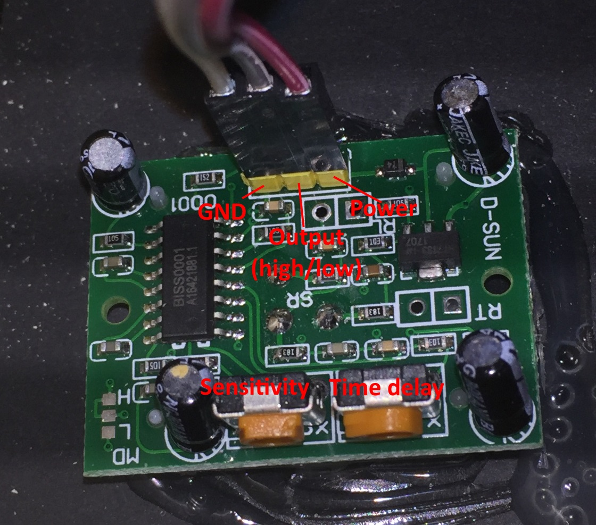

# MMM-PYPIR
MagicMirror module for turning on or off the monitor in reaction to a PIR sensor

While building my second Magic Mirror, I once again stumbled over the intransparent and hard to fix version requirements electron sets on native node modules.
Using the [MMM-PIR-Sensor module](https://github.com/paviro/MMM-PIR-Sensor) as a starting point, I got rid of the onoff dependency which in turn requires a native module.
Electron uses its own node.js version, so even when I was able to use the module outside of my Magic Mirror for some standalone tests, I'd always get errors because of different tool versions.
So I decided to create an alternative for MMM-PIR-Sensor not relying on a native module.
Because Python on the Raspberry Pi includes modules for easy (and complete) access to the GPIO ports, the idea was to write small Python scripts and communicate with them using stdin/stdout (hence the name PYPIR).

# Architecture
MMM-PYPIR registers as a Magic Mirror module named 'MMM-PYPIR' and can be activated using the config.js file from MagicMirror.
At startup, a small Python script is being started with the pin to watch and the pullup/pulldown configuration for this pin.
This script simply outputs '0' or '1' when the PIN's level changes.
Every time MMM-PYPIR receives this input, a socketNotification named `USER_PRESENCE` is being created with `0` or `1` as payload.

# Installation
To use this module with your MagicMirror installation, go to the `modules` subdirectory of your MagicMirror installation and execute 
```
git clone https://github.com/mavnorthwind/MMM-PYPIR
cd MMM-PYPIR
npm install
```

# Wiring
There are quite a few PIR sensors out there, but from my experience they mostly work the same.
For my second mirror I got me an "HC-SR501 PIR MOTION DETECTOR" sensor für just a few €. If you google for it you can find a datasheet with all the neccessary information.

Setting up the sensor is pretty straightforward: Connect the PIR to your Raspberry Pi using 3 cables: 



For my setup, I connected GND to Pin 06, Power to Pin 04 (+5V) and Output to Pin 07 (GPIO 04):


With Python's RPi.GPIO module, you can use either board pin numbering or BCM numbering. I chose BCM mode, so the pin number for the python script to watch was 4 (GPIO 04).

# Configuration
As usual, the module can be configured using MagicMirror's config.js file.
Possible settings contain:
```javascript
config: {
  sensorPIN: 22,       // in BCM notation, see above
  pullUpDown: 'down',  // configure the pin for pulldown ('down') or pullup ('up')
  powerSaving: true,   // turn monitor on/off when the PIR registers movement
  powerSavingDelay: 10 // delay (in seconds) after the PIR has stopped registering movement to turn off the monitor
}
```
If `powerSaving` is set to `true`, the monitor is being switched on or off in reaction to the PIR signals. Otherwise just the `USER_PRESENCE`notification is being broadcast.
Because it can be tricky to adjust the inactivity delay on the PIR sensor itself, I'd suggest setting it to the minimum duration possible (usually 5 seconds) and then add a `powerSavingDelay`. So with 5 seconds HW delay and a `powerSavingDelay` of 10 seconds, the monitor will turn off 15 seconds after the PIR registered the last movement. If you start moving within these 15 seconds, the monitor stays on.
